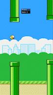

# Flappy Bird

Flappy bird remade in low level C++ and OpenGL using ImGui and GLFW. No Game engine or library was used.

# How to Build

This is built using Visual Studio.

1. Clone the repository
2. Open the solution and build
3. Run solution

All dependencies are statically linked inside of the project so the solution should just build easily
